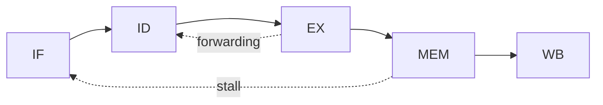

# StudyLab — Piano di costruzione

Sistema locale di gestione dello studio: cattura appunti → schemi → flashcard →
compattazione → testing, con Claude (abbonamento Pro) come motore di
trasformazione. Nessuna API a pagamento, nessun dato fuori dal PC.

---

## 0. La decisione architetturale chiave: come usare Claude senza pagare API

**Il punto da capire subito:** Claude Code (quello che stai usando adesso) si
autentica con il tuo abbonamento Pro, non con una API key. Ed è invocabile da
riga di comando in modalità headless:

```bash
claude -p "prompt..." < input.md > output.md
```

Questo significa che **Claude Code *è* il tuo backend AI**. Non devi costruire
un'integrazione: costruisci un vault di file Markdown e una serie di *skill*
(`.claude/skills/`) che sanno leggerli e trasformarli. Il "SaaS" non è un
server con un modello dietro: è un repository + un set di comandi.

### Il vincolo che determina tutto il design

L'abbonamento Pro ha **rate limit** (finestre di utilizzo). Quindi:

> **Regola d'oro: l'AI è un processo batch che *tu* lanci, mai una dipendenza
> runtime dell'applicazione.**

L'app di ripasso deve funzionare perfettamente a Claude spento. Claude serve a
*produrre artefatti* (schemi, flashcard, esercizi) che poi vivono come file
statici. Se progetti un'app che chiama l'AI a ogni click, un giorno di rate
limit ti blocca lo studio. Se progetti un'app che legge file generati ieri,
non ti blocca mai.

### Cosa NON fare

- Automatizzare claude.ai via browser/Selenium per simulare un'API: fragile,
  contro i ToS, si rompe a ogni aggiornamento.
- Modelli locali (Ollama) per generare le flashcard: su hardware consumer la
  qualità su materiale tecnico universitario è troppo bassa per fidarsi.
  Usali semmai per la trascrizione audio (vedi §7).
- Un database come sorgente di verità. I file Markdown lo sono.

---

## 1. Struttura del vault

```
StudyLab/
├── CLAUDE.md                  # istruzioni permanenti per Claude su questo repo
├── .claude/
│   ├── skills/                # i comandi del "gestionale"
│   └── settings.json
├── materie/
│   └── architettura/
│       ├── materia.yml        # metadati: docente, tipo esame, date, syllabus
│       ├── 00-inbox/          # cattura grezza, non processata
│       ├── 01-lezioni/        # 1 file per lezione, appunti puliti
│       │   └── 2026-09-15-pipeline-hazard.md
│       ├── 02-concetti/       # note atomiche: 1 concetto = 1 file = 1 ID
│       │   └── C-ARCH-0042-data-hazard.md
│       ├── 03-sintesi/        # compattazioni settimanali/mensili
│       │   ├── settimana-2026-W38.md
│       │   └── mensile-2026-09.md
│       ├── 04-flashcard/      # mazzi, un file per argomento
│       │   └── pipeline.md
│       ├── 05-esami/
│       │   ├── originali/     # PDF/scan dei temi d'esame passati
│       │   ├── estratti/      # esercizi strutturati estratti dai PDF
│       │   └── generati/      # varianti prodotte da Claude
│       └── 06-simulazioni/    # tentativi tuoi + correzioni
├── srs/
│   └── state.json             # stato ripetizioni (l'unico "database")
├── app/                       # web app locale di ripasso
└── risorse/                   # PDF, slide, registrazioni (fuori da git)
```

### Perché le note atomiche (`02-concetti/`) sono il cuore

È la scelta che fa la differenza tra un sistema che scala e una cartella di
file. Ogni concetto ha un **ID stabile** (`C-ARCH-0042`). Quella stringa viene
referenziata da:

- la lezione in cui è comparso,
- le flashcard che lo testano,
- la sintesi settimanale che lo comprime,
- l'esercizio d'esame che lo richiede.

Da qui nascono gratis query come: *quali concetti non ho mai testato?*,
*questo esercizio d'esame quali concetti copre?*, *cosa sbaglio più spesso?*
Senza ID, ognuna di queste richiede lavoro manuale.

### Schema del frontmatter

Nota-concetto:

```yaml
---
id: C-ARCH-0042
titolo: Data hazard RAW
materia: architettura
tipo: concetto           # concetto | definizione | procedura | dimostrazione
lezione: 2026-09-15
prerequisiti: [C-ARCH-0038, C-ARCH-0040]
confidenza: 2            # 0-5, aggiornata dal testing
tag: [pipeline, hazard]
stato: attivo            # bozza | attivo | archiviato
---
```

Flashcard (dentro un mazzo markdown per argomento):

```markdown
## [C-ARCH-0042] Cosa distingue un hazard RAW da un WAR?
?
RAW = dipendenza vera (lettura dopo scrittura), non eliminabile con renaming.
WAR = dipendenza di nome, eliminabile con register renaming.
<!-- srs: 4f2a1b -->
```

L'id `<!-- srs: ... -->` è la chiave nel file di stato: così puoi riscrivere il
testo della carta senza perdere lo storico delle ripetizioni.

---

## 2. Le cinque fasi, tradotte in comandi

Ogni fase è una skill in `.claude/skills/`, invocabile come slash command.

### Fase 1 — Acquisizione (`/cattura`)

Input possibili, tutti già gestibili a costo zero:

- **Foto di appunti a mano** → Claude Code legge le immagini nativamente. Le
  butti in `00-inbox/` e lui le trascrive. È la feature che ti fa risparmiare
  più tempo in assoluto.
- **Slide PPTX/PDF del docente** → estratte a testo. Richiede `poppler-utils`
  e `libreoffice` nel worker (vedi §8) — verificato su materiale reale che
  senza non funziona con PDF scansionati o PPTX con ink a mano libera.
- **Digitazione diretta** nel file della lezione.
- **Registrazione audio** → trascrizione locale (vedi §7).

Output: `01-lezioni/AAAA-MM-GG-argomento.md`, testo grezzo ma leggibile.
Nessuna elaborazione: separare cattura e pulizia evita di perdere informazione.

### Fase 2 — Pulizia e schematizzazione (`/schematizza`)

Prende la lezione del giorno e produce:

1. uno **schema gerarchico** in coda al file lezione;
2. le **note atomiche** in `02-concetti/`, una per concetto nuovo, con ID
   progressivi;
3. i **collegamenti** ai concetti già esistenti (prerequisiti).

Vincolo da scrivere esplicitamente nella skill: *non inventare contenuto non
presente negli appunti*. Se un passaggio è incomprensibile deve marcarlo
`> ❓ DA CHIARIRE` invece di riempire il buco. È la differenza tra uno
strumento affidabile e uno che ti fa studiare allucinazioni.

### Fase 3 — Flashcard (`/genera-flashcard`)

Genera carte dai concetti non ancora coperti. Regole da mettere nella skill:

- **max 3-5 carte per concetto** — la tentazione è generarne cinquanta, e poi
  non ripassi più nulla;
- una carta = un fatto atomico, mai domande a cascata;
- per matematica: separare *enunciato*, *ipotesi*, *idea della dimostrazione*
  (sapere l'enunciato e non l'idea è il classico buco all'orale);
- niente risposte sì/no o indovinabili dalla domanda;
- ogni carta nasce `stato: proposta` finché non la approvi.

**La curazione è obbligatoria.** Cinque minuti a cancellare le carte inutili.
Le flashcard sono un debito: ogni carta cattiva te la porti dietro per mesi.

### Fase 4 — Compattazione (`/compatta settimana|mese`)

Legge lezioni e concetti del periodo e produce in `03-sintesi/`:

- mappa dei concetti del periodo e loro relazioni,
- schema unico di ~2 pagine,
- **elenco dei nodi deboli** (confidenza bassa o mai testati),
- domande di collegamento trasversale — quelle che il professore fa
  all'orale: *mi colleghi X con Y?*

La compattazione mensile ricompatta le settimanali, non le lezioni: struttura
ad albero, altrimenti a fine semestre hai un documento illeggibile.

### Fase 5 — Testing

Due modalità, perché i tuoi due esami sono diversi.

**Orale — `/interroga <materia> [argomento]`**
Claude ti interroga in chat: domanda → tua risposta → valutazione → domanda di
approfondimento se la risposta è superficiale. A fine sessione scrive un
report in `06-simulazioni/` e aggiorna la `confidenza` dei concetti toccati.
Severità configurabile (professore esigente vs. ripasso morbido).

**Scritto — `/simula-esame <materia>`**

1. `/estrai-esami` legge i PDF in `05-esami/originali/` (per Architettura li
   hai già) e li struttura: per ogni esercizio → tipologia, concetti
   richiesti, difficoltà, punteggio, schema di soluzione.
2. Da quella *tassonomia* Claude genera **varianti nuove**: stessi pattern,
   numeri diversi. È il vero valore del sistema — invece di ripassare quattro
   temi d'esame finché li sai a memoria, ne hai infiniti dello stesso stampo.
3. Simulazione a tempo → risolvi su carta o file → `/correggi` con rubrica
   basata sui punteggi reali del docente.

---

## 3. Il motore di ripetizione spaziata (SRS)

Questo **non** lo fa l'AI: è un algoritmo deterministico, circa 200 righe.

- Algoritmo: **FSRS** (migliore di SM-2, implementazioni open in Python e TS)
  oppure SM-2 se vuoi restare semplice. Parti da SM-2, migri dopo.
- Stato in `srs/state.json`: per ogni card-id → `{due, stability, difficulty,
  reps, lapses, storico}`. JSON e non SQLite perché versionabile in git e
  ispezionabile a mano.
- **Interleaving**: mescola le materie nella sessione giornaliera. Studiare a
  blocchi separati dà l'illusione di padronanza; l'interleaving è più faticoso
  e retiene molto di più.
- Cap giornaliero di carte nuove (es. 15 per materia), altrimenti dopo tre
  settimane hai 400 ripassi arretrati e molli.

**Implementato** in `cli/ripassa.js` + `cli/lib/srs.js`: SM-2 a grana
giornaliera (variante Again/Hard/Good/Easy, come Anki), zero dipendenze
esterne. Tre comandi: `stato`, `cura`, `studia` — vedi CLAUDE.md per l'uso.
È già uno strumento di ripasso completo e utilizzabile da terminale, prima
ancora che esista la web app (Fase 4/8).

⚠️ **Insidia reale incontrata nell'implementazione, da non ripetere nella web
app:** calcolare la data di scadenza con `new Date(...).toISOString()`
sbaglia di un giorno con fuso orario positivo (es. CEST, UTC+2) — la
mezzanotte locale corrisponde alle 22:00 UTC del giorno *precedente*, quindi
`toISOString().slice(0,10)` riporta indietro la data. Va usata aritmetica
sui componenti data locali (`getFullYear`/`getMonth`/`getDate`), mai un
giro per UTC, per qualsiasi calcolo di date a grana giornaliera — vale anche
per il countdown esame e per `/compatta settimana|mese`.

---

## 4. L'interfaccia

**Raccomandazione: web app locale.** Non TUI, non Electron.

- Vite + React + TypeScript, piccolo server Node che legge i `.md` e scrive
  `state.json`. Avvio con `npm run dev`, si apre nel browser.
- Perché: il ripasso lo fai 20 minuti al giorno da tastiera, e ti serve
  rendering **LaTeX** (KaTeX — indispensabile per Matematica) e immagini. Una
  TUI non te lo dà, Electron sono 300 MB per niente.

Schermate in ordine di priorità:

1. **Ripasso** — carta, spazio per rivelare, 1-4 per valutare. Tutto da
   tastiera, zero mouse. **Implementato.**
2. **Dashboard** — carte in scadenza per materia, giorni all'esame, heatmap
   della confidenza per argomento, concetti mai testati. **Implementata**
   (senza countdown esame e heatmap per ora: bastano `nome`/`data_esame` in
   `materia.yml` quando popolati per aggiungerli).
3. **Browser dei concetti** — ricerca e grafo dei prerequisiti. **Versione
   minima implementata** (elenco filtrabile per titolo/ID/tag); il grafo dei
   prerequisiti resta da fare.
4. **Simulazione d'esame** — timer, esercizi, area di risposta. Non ancora
   implementata: dipende da `/estrai-esami` (Fase 6), non ha senso costruire
   l'interfaccia prima del motore che la alimenta.

**Implementato** in `app/` (Vite + React + TypeScript + Express), come
descritto in CLAUDE.md. Il server riusa `cli/lib/*` — stessa logica della
CLI (Fase 3), non una riscrittura: SM-2, parsing dei mazzi e costruzione
della sessione restano un'unica fonte di verità tra CLI e web app.

⚠️ **Insidia reale incontrata nel deploy**, rilevante per §8: un tool di
preview/dev che inietta `PORT` nell'ambiente per il "processo principale"
del dev server propaga quella variabile anche a processi paralleli lanciati
con `concurrently` — se il server API legge la stessa `PORT`, collide con il
frontend sulla stessa porta. Va usato un nome di variabile dedicato per
l'API (qui: `API_PORT`), mai `PORT` condiviso tra più processi nello stesso
comando `dev`.

**E Obsidian?** Con il requisito multi-dispositivo (fisso, portatile, tablet
fuori casa) Obsidian **non è più la scelta primaria**: richiederebbe una
sincronizzazione del vault su tre dispositivi (Obsidian Sync a pagamento, o
Syncthing/WebDAV con i conflitti che ne derivano). Con il vault che vive sul
server (§8) il browser è l'unico client e il problema sparisce.

Obsidian resta utile come **editor desktop secondario** sullo stesso vault
montato via SMB: ottimo per sessioni lunghe di scrittura e per il grafo. La
regola per evitare guai è una sola: un vault, una copia, quella sul server —
mai copie locali sincronizzate.

---

## 5. Roadmap realistica

| Fase | Cosa | Tempo | Già utilizzabile? |
|---|---|---|---|
| 0 | ✅ Struttura vault + CLAUDE.md + materia.yml | 1 sera | — |
| 1 | ✅ `/cattura` + `/schematizza` | 1-2 sere | **Sì**: risparmio di tempo immediato |
| 2 | ✅ `/genera-flashcard` + formato carte | 1 sera | Sì, ripassando a mano |
| 3 | ✅ Motore SRS + CLI di ripasso minimale | 2-3 sere | **Sì**: sistema base completo |
| 4 | ✅ Web app di ripasso (KaTeX) | 3-5 sere | Esperienza vera |
| 5 | `/compatta` settimanale e mensile | 1 sera | Da fine primo mese |
| 6 | `/estrai-esami` + `/simula-esame` + `/correggi` | 2-3 sere | Sotto sessione |
| 7 | Statistiche avanzate (heatmap, countdown esame) | 2 sere | Nice to have — dashboard base già in Fase 4 |
| 8 | Deploy su home server + accesso remoto (§8) | 1-2 sere | Sì, da tutti i dispositivi |
| 9 | Editor di schemi e digitalizzazione (§9) | 3-4 sere | Chiude il ciclo |

**Usa il sistema dalla Fase 1.** Il rischio numero uno di questo progetto è
passare tre settimane a costruirlo mentre le lezioni scorrono, e ritrovarti
con uno strumento perfetto e un semestre di arretrato. Ogni fase deve essere
usabile da sola.

---

## 6. Consigli extra

### Sul metodo

- **Non generare flashcard il giorno stesso della lezione.** Aspetta 24-48 ore:
  la rielaborazione dopo la prima dimenticanza è molto più efficace, e nel
  frattempo capisci cosa hai davvero assimilato.
- **Scrivi tu le carte più importanti.** La generazione automatica è ottima per
  definizioni e fatti; per i concetti chiave la fatica di formulare la domanda
  *è* lo studio. Delegala e perdi il pezzo migliore.
- **Traccia gli errori, non i successi.** Un `errori.md` per materia con ciò
  che sbagli ripetutamente vale più di dieci schemi. Alla vigilia dell'esame
  ripassi quello.
- **Registra le lezioni solo se poi le trascrivi.** Novanta minuti di audio
  mai riascoltati sono peso morto.

### Sul sistema

- **Commit giornaliero automatico.** Un hook o un task pianificato che fa
  `git commit -am "studio <data>"` ogni sera. Backup, storico, e la
  soddisfazione del grafo dei contributi.
- **PDF fuori da git**, o con Git LFS. Trentadue PDF di slide gonfiano il repo
  per sempre. `risorse/` in `.gitignore`, backup separato.
- **Un `CLAUDE.md` serio alla radice**: convenzioni di naming, schema del
  frontmatter, regole di generazione delle carte, glossario dei termini dei
  tuoi corsi. È ciò che rende le skill consistenti nel tempo — aggiornalo ogni
  volta che correggi Claude su qualcosa.
- **Validatore.** Uno script che controlla ID duplicati, link rotti,
  frontmatter malformato, carte orfane. Da lanciare pre-commit. Con centinaia
  di file, senza validatore il vault marcisce in silenzio.
- **Commit separati per il generato.** Le carte prodotte da Claude in un commit
  distinto dalle tue modifiche manuali: se una generazione va male, `git
  revert` e via.
- **Modalità pre-esame.** Un comando che, a N giorni dall'esame, ignora lo
  scheduling normale e ti fa passare tutto per confidenza crescente.

### Sui rate limit

- Batch serale: schematizzi tutte le lezioni del giorno in una sessione sola,
  non una chiamata alla volta.
- Le operazioni pesanti (estrazione esami, compattazione mensile) nei weekend o
  a finestra fresca.
- Lavora a coda: `00-inbox/` si svuota quando puoi, invece di bloccarti quando
  il limite è esaurito.

---

## 7. Componenti opzionali

- **Trascrizione audio lezioni**: `faster-whisper` in locale (modello `medium`
  gira su CPU decente, `large-v3` con GPU). Gratuito, offline, ottimo in
  italiano. Output in `00-inbox/` → `/schematizza`.
- **OCR appunti a mano**: non serve Tesseract. Claude Code legge le foto
  direttamente e sulla scrittura a mano se la cava molto meglio di un OCR
  classico.
- **Export Anki**: generatore di `.apkg` dai mazzi, per ripassare in mobilità.
  Il vault resta la sorgente di verità, Anki è solo un target di export — mai
  bidirezionale, la sincronizzazione a due vie è una fonte infinita di
  conflitti.
- **Calendario**: date d'esame in `materia.yml` → countdown in dashboard e
  pianificazione a ritroso dei ripassi.

---

## 8. Hosting sull'home server

Requisito: usarlo da PC fisso, portatile e tablet fuori casa, restando tutto in
locale.

### Il principio: una sola copia del vault

La tentazione è sincronizzare il vault su tre dispositivi (Syncthing, Resilio,
cartella condivisa). **Non farlo.** Un vault Markdown sincronizzato in
multi-master genera conflitti proprio sui file che modifichi più spesso, e
`state.json` dell'SRS è il caso peggiore in assoluto: due dispositivi che
ripassano lo stesso giorno producono due storici divergenti e nessun merge
sensato.

> **Il vault vive in un unico posto: il server. I dispositivi sono client
> browser.** Niente sync, niente conflitti, backup in un punto solo.

Il tablet fuori casa non ha bisogno di una copia: ha bisogno di una
connessione. Che è il problema successivo, e si risolve in cinque minuti.

### Accesso da fuori casa: Tailscale

Non aprire porte sul router, non esporre il server su Internet. Installa
**Tailscale** (gratis fino a 100 dispositivi, il piano personale basta e
avanza): crea una VPN mesh WireGuard tra i tuoi dispositivi. Il server ottiene
un indirizzo stabile tipo `100.x.y.z` e un nome DNS `studylab.<tuo-tailnet>.ts.net`
raggiungibile da fisso, portatile e tablet ovunque siano, senza configurare
nulla sul router.

- App Tailscale su Android/iPadOS: installi, fai login, e il tablet vede il
  server come se fossi in casa.
- Con **Tailscale Serve** ottieni anche HTTPS con certificato valido, che ti
  serve perché alcune API del browser (service worker per la PWA offline,
  stylus/pointer events) richiedono un contesto sicuro.
- Alternativa se preferisci un dominio pubblico: **Cloudflare Tunnel** — ma
  fa passare il traffico da terzi, e contraddice il requisito "sistema chiuso".
  Tailscale resta la scelta giusta qui.
- Alternativa senza dipendenze esterne: **WireGuard** configurato a mano. Più
  controllo, più lavoro, stesso risultato.

### Architettura dei container

Tre servizi, un volume.

```
/srv/studylab/
├── vault/                  # il repository Markdown (§1) — clonato da git
│   └── deploy/
│       └── docker-compose.yml
└── claude-config/          # credenziali e config di Claude Code (persistenti)
```

Tailscale gira già sull'host (come nel tuo caso), quindi **niente sidecar**:
solo due servizi.

```yaml
services:
  web:
    # UI + API: legge/scrive i .md e srs/state.json
    build: ../app
    volumes:
      - /srv/studylab/vault:/vault
    environment:
      - VAULT_PATH=/vault
    ports:
      - "127.0.0.1:8080:8080"   # esposto solo via Tailscale Serve
    restart: unless-stopped

  worker:
    # Claude Code headless: consuma la coda dei job
    build: ../worker
    volumes:
      - /srv/studylab/vault:/vault
      - /srv/studylab/claude-config:/home/node/.claude
    environment:
      - VAULT_PATH=/vault
    restart: unless-stopped
```

L'immagine del worker è semplicemente Node + `npm i -g @anthropic-ai/claude-code`.

**Non basta però solo Node.** Il worker è quello che esegue `/cattura` su
tutto ciò che l'utente butta in `00-inbox/` (foto, PDF, slide), e due
formati reali emersi testando la Fase 1 su materiale vero richiedono
strumenti di sistema aggiuntivi nell'immagine — altrimenti la skill fallisce
silenziosamente proprio sui file più comuni:

- **`poppler-utils`** — necessario per far leggere a Claude le pagine di un
  PDF come immagini (rendering pagina → PNG). Senza, `/cattura` non riesce a
  processare PDF scansionati o slide esportate in PDF. `apt install
  poppler-utils`.
- **`libreoffice`** (headless) — necessario per le slide `.pptx` che
  contengono **ink di PowerPoint**: quando un docente scrive a mano col
  pennino direttamente sulle slide, PowerPoint salva ogni tratto come
  immagine EMF separata invece che una foto per slide intera. Estrarre le
  immagini "a mano" prende frammenti illeggibili; `soffice --headless
  --convert-to png` invece compone i livelli correttamente e produce
  un'immagine per slide, pronta per la lettura diretta. `apt install
  libreoffice`.

Sulla macchina di sviluppo Windows nessuno dei due è presente di default —
motivo per cui questi due casi vanno verificati con un test reale prima di
fidarsi della skill in produzione. Su Ubuntu (il server di destinazione)
entrambi si installano con un `apt install` in un minuto: aggiungerli al
`Dockerfile` del worker, non all'host.

```dockerfile
# worker/Dockerfile — estratto
RUN apt-get update && apt-get install -y --no-install-recommends \
      poppler-utils \
      libreoffice \
    && rm -rf /var/lib/apt/lists/*
```

### Il punto delicato: l'autenticazione di Claude nel container

Claude Code si autentica con l'abbonamento Pro tramite un flusso di login
interattivo (device code nel browser). **Non è automatizzabile**, e va fatto
una volta sola:

```bash
docker compose exec -it worker claude
```

Completi il login dal browser, e le credenziali finiscono in
`/srv/studylab/claude-config`, che è un volume persistente: sopravvive a
restart e rebuild. Va rifatto solo se le credenziali scadono.

Due conseguenze da tenere a mente:

- **Il rate limit è del tuo account, non della macchina.** Se il worker sta
  macinando una compattazione mensile e tu nel frattempo chatti su claude.ai,
  attingete alla stessa finestra. Il worker deve avere **concorrenza 1** e una
  coda: mai job paralleli.
- **Non condividere l'accesso con altri.** Un'istanza raggiungibile da terzi
  significa che consumano il tuo abbonamento a tuo nome. Tailscale risolve
  anche questo: solo i tuoi dispositivi.

### Come la dashboard chiede lavoro all'AI: la coda dei job

Questo è il pezzo che tiene insieme il §0 (l'AI è batch, non runtime) con
l'esigenza di premere un pulsante dal tablet.

```
vault/_jobs/
├── queue/     job-20260915-141233.json
├── running/
├── done/
└── failed/
```

Un job è un file JSON minimale:

```json
{
  "skill": "schematizza",
  "args": { "materia": "architettura", "lezione": "2026-09-15" },
  "creato": "2026-09-15T14:12:33+02:00"
}
```

Il flusso:

1. Dal tablet premi **"Schematizza la lezione di oggi"**.
2. La web app scrive un file in `queue/`. Risponde subito: la richiesta è
   accodata. **Nessuna attesa, nessun timeout HTTP.**
3. Il worker fa polling della cartella, sposta il job in `running/`, e lancia
   nella directory del vault:

   ```bash
   claude -p "/schematizza architettura 2026-09-15" \
          --permission-mode acceptEdits \
          --allowed-tools "Read,Write,Edit,Glob,Grep"
   ```

4. Claude scrive i file nel vault. Il worker sposta il job in `done/` con il
   log e i file toccati, e fa un commit git.
5. La dashboard mostra lo stato dei job; quando è pronto, il risultato è lì.

Vantaggi non ovvi di questo design: chiudere il tablet non annulla il lavoro;
se il rate limit è esaurito il job resta in coda e riparte dopo; hai uno
storico completo di cosa ha fatto l'AI e quando; e puoi accodare dieci lezioni
arretrate e andare a dormire.

### Sicurezza e igiene

- **Permessi ristretti del worker.** Allowlist esplicita degli strumenti,
  niente `Bash` se non ti serve, e il container vede *solo* `/vault`. Un
  agente headless con permessi larghi su un server è una cattiva idea a
  prescindere dalle buone intenzioni.
- **Nessuna autenticazione applicativa** è accettabile *solo* perché
  l'accesso è già ristretto da Tailscale. Se un giorno esponi l'app
  altrimenti, serve un login prima.
- **Backup**: il vault è un repo git. Un `git push` notturno su un repo
  privato (o su un secondo disco) e sei coperto. I PDF in `risorse/` con
  rsync a parte.
- **Il tablet offline**: PWA con service worker che cachea le carte in
  scadenza del giorno e accoda le valutazioni in locale, sincronizzandole al
  rientro. È l'unico pezzo di "sync" accettabile, perché riguarda solo un
  append di eventi e non la modifica di file condivisi. Da fare tardi, non
  serve per partire.

### Deploy sul tuo server (Ubuntu + Tailscale già attivo)

Poiché Tailscale gira già sull'host, **non serve il sidecar** del compose qui
sopra: elimina quel servizio. Il resto è lineare.

```bash
# 1. Preparazione
sudo mkdir -p /srv/studylab/{vault,claude-config}
sudo chown -R $USER:$USER /srv/studylab

# 2. Il vault è un repo git: clonalo o inizializzalo
cd /srv/studylab
git clone <tuo-repo-StudyLab> vault
#   in alternativa, se parti da zero:  git init vault

# 3. Avvio
cd /srv/studylab/vault/deploy
docker compose up -d --build

# 4. Login di Claude nel worker — una volta sola, interattivo
docker compose exec -it worker claude
#   completi il device-code dal browser; le credenziali restano
#   in /srv/studylab/claude-config e sopravvivono ai rebuild

# 5. Esposizione via Tailscale, con HTTPS valido
sudo tailscale serve --bg 8080
#   → https://<nome-server>.<tuo-tailnet>.ts.net
```

Nota su `tailscale serve`: usa `serve` e **non** `funnel`. `serve` espone il
servizio solo alla tua tailnet; `funnel` lo pubblica su Internet, che è
esattamente ciò che non vuoi. Il certificato HTTPS è automatico e ti serve per
il service worker della PWA e per gli eventi del pennino sul tablet.

Sul tablet: app Tailscale, login, e apri l'URL `.ts.net`. Da iPadOS e Android
puoi aggiungerlo alla home come app a tutto schermo.

### Accesso al vault da desktop, per Obsidian o per editing diretto

Se vuoi aprire lo stesso vault con Obsidian dal fisso o dal portatile, esponi
`/srv/studylab/vault` via Samba e montalo come unità di rete. Vale la regola
del §8: **una copia sola**, quella sul server — mai un clone locale
sincronizzato, o torni al problema dei conflitti.

```bash
sudo apt install samba
# in /etc/samba/smb.conf
# [studylab]
#   path = /srv/studylab/vault
#   valid users = <tuo-utente>
#   read only = no
```

Raggiungibile come `\\<nome-server>\studylab` anche fuori casa, perché passa
dentro la tailnet.

### Backup

Il vault è un repo git, quindi il backup è già metà risolto:

```bash
# cron notturno sul server
0 3 * * * cd /srv/studylab/vault && git push backup main
```

Aggiungi un remote su un secondo disco (`git remote add backup /mnt/backup/studylab.git`,
creato con `git init --bare`) o su un repo privato. I PDF in `risorse/` sono
fuori da git: `rsync` separato.

### Se un domani cambi macchina

Tutto lo stato del sistema è in due directory: `vault/` (i contenuti, in git)
e `claude-config/` (le credenziali, da rifare con un login). Non c'è database
da dumpare, non c'è migrazione. È il vantaggio principale dell'aver scelto
file Markdown come sorgente di verità.

---

## 9. Schemi: crearli, disegnarli, renderli leggibili dall'AI

Questa è la fase che chiude il ciclo, ed è quella con la decisione di design
più interessante. Il requisito ha due facce in tensione:

- **tu** vuoi disegnare lo schema, perché l'atto di disegnarlo *è* la
  comprensione (hai ragione: uno schema ricevuto passivamente non imprime
  niente);
- **l'AI** deve poterlo leggere per generare flashcard, compattare e
  interrogarti.

La soluzione non è scegliere un formato che accontenti entrambi — non esiste.
È tenere **due rappresentazioni collegate dallo stesso ID di concetto**: una
per te, una per la macchina, con una conversione automatica tra le due.

### Tre modi di fare uno schema, in ordine di attrito crescente

**A. Outline → mappa mentale automatica (attrito zero, usalo di default)**

Scrivi una lista puntata indentata in Markdown. La dashboard la rende come
mappa mentale con **markmap** (libreria JS, zero backend). Non c'è nessun
formato nuovo: lo schema *è* il markdown, quindi è già perfettamente leggibile
dall'AI, versionabile in git, e cercabile.

```markdown
- Pipeline
  - Hazard
    - Strutturali → risorsa condivisa
    - Dati (C-ARCH-0042)
      - RAW — dipendenza vera
      - WAR/WAW — risolvibili con renaming
    - Controllo → branch prediction
```

Sorprendentemente è il 70% dei casi. La gerarchia è ciò che ti serve quasi
sempre, e digitare è più veloce che disegnare.

**B. Mermaid, per relazioni che non sono gerarchie**

Quando servono frecce trasversali, cicli, macchine a stati, sequenze. È testo,
quindi AI-nativo al 100%: Claude può **generarlo, leggerlo e modificarlo**
senza perdita. La dashboard lo renderizza nativamente.



Il grande vantaggio: puoi chiedere *"aggiungi al diagramma il percorso di
forwarding da MEM"* e funziona. Con un disegno raster non funziona.

**C. Canvas libero, per quando lo spazio conta**

Per schemi spaziali, disegni a mano libera col pennino sul tablet, formule
scritte a mano. Due opzioni self-hostabili:

- **Excalidraw** — look a mano libera, ottimo supporto stylus, container
  ufficiale, si integra in React. Il file è JSON.
- **JSON Canvas** (lo standard aperto dietro Obsidian Canvas) — JSON
  semplicissimo di nodi e archi, dove i nodi possono *puntare a file del
  vault*. Editabile sia nella tua dashboard sia in Obsidian.

**Per il tuo caso JSON Canvas è la scelta migliore**, per un motivo preciso: un
nodo può essere un riferimento a `02-concetti/C-ARCH-0042-*.md`. Lo schema
diventa letteralmente una vista sui tuoi concetti, non un disegno scollegato
che li duplica. Se sposti o modifichi il concetto, lo schema resta coerente.
Excalidraw disegna pixel; JSON Canvas disegna il tuo grafo di conoscenza.

### La conversione: `/digitalizza-schema`

È il pezzo che chiedevi — "lo faccio a mano e poi lo rendo leggibile". Vale sia
per la foto di uno schema su carta, sia per un canvas disegnato col pennino.

1. Butti l'immagine (foto, scansione, export PNG del canvas) in `00-inbox/`.
2. Lanci lo skill dalla dashboard (che accoda un job, §8).
3. Claude legge l'immagine — **nativamente, senza OCR**, ed è molto più bravo
   di un OCR classico sulla scrittura a mano — e produce:
   - l'**outline Markdown** equivalente,
   - il **Mermaid** se ci sono relazioni non gerarchiche,
   - il **collegamento agli ID** dei concetti già esistenti, e la
     segnalazione dei concetti nuovi da creare,
   - le **incertezze** marcate `> ❓ non leggo bene questo nodo`, mai indovinate.
4. Il risultato finisce accanto all'originale:

```
02-concetti/
03-schemi/
├── pipeline-hazard.canvas        # il tuo disegno (o la foto originale)
├── pipeline-hazard.md            # la trascrizione AI-leggibile
└── pipeline-hazard.png           # eventuale scansione sorgente
```

Stesso nome, estensioni diverse: il disegno resta il *tuo* artefatto (quello
che ti imprime la comprensione e che riguarderai), il `.md` è quello che
alimenta flashcard, compattazioni e interrogazioni.

### Il flusso completo di una lezione

```
lezione → appunti grezzi (00-inbox)
            ↓ /schematizza
        schema proposto da Claude ─────┐
            ↓                          │ confronto
        TU rifai lo schema a modo tuo ─┘   ← qui avviene l'apprendimento
            ↓ /digitalizza-schema
        versione AI-leggibile + ID concetti
            ↓ /genera-flashcard
        carte → SRS → testing
```

Il passaggio chiave è il **confronto**: guardi lo schema di Claude *dopo* aver
fatto il tuo, non prima. Le differenze tra i due sono l'informazione più
preziosa che il sistema produce — ti dicono esattamente cosa non hai capito o
cosa hai trascurato. Vale la pena che la dashboard abbia una vista affiancata
proprio per questo, e un comando `/confronta-schemi` che elenchi in tre righe
cosa manca nel tuo.

Questo, tra l'altro, risolve l'obiezione di fondo a tutto il progetto: uno
strumento che schematizza al posto tuo ti rende più veloce e più ignorante.
Uno strumento che schematizza *in parallelo* a te e ti mostra il delta ti
rende più bravo.

### Editor nella dashboard: cosa costruire davvero

Non costruire un editor grafico da zero. Sono settimane di lavoro per
riottenere qualcosa di peggiore di quello che esiste.

1. **Outline + preview markmap affiancata** — un `<textarea>` e una libreria.
   Mezza giornata, copre il 70% dei casi.
2. **Blocchi Mermaid con preview live** — altra mezza giornata, stessa logica.
3. **Canvas**: integra JSON Canvas (formato aperto, lo scrivi tu) oppure
   incorpora Excalidraw. Solo dopo che 1 e 2 sono in uso da qualche settimana,
   così saprai se ti serve davvero.
4. **Upload foto + `/digitalizza-schema`** — questo invece fallo presto: è il
   ponte tra la carta (dove probabilmente lavori meglio) e il sistema.

---

## 10. Prossimo passo

Fase 0 + Fase 1: struttura del vault, `CLAUDE.md`, e le skill `/cattura` e
`/schematizza`, testate sul materiale di Architettura e Matematica che hai già.
Il vault nasce direttamente sul server, così non c'è nessuna migrazione dopo.
Da domani gli appunti entrano nel sistema.
